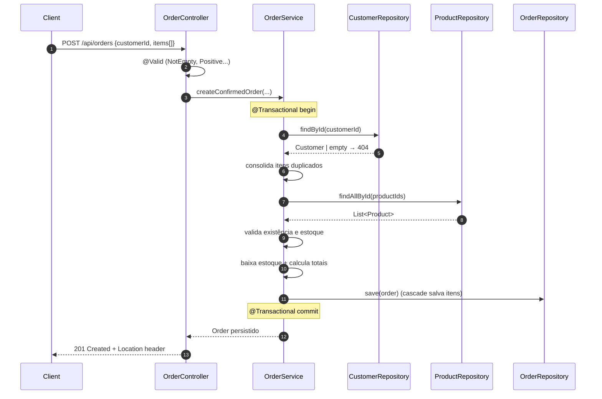

# OMS-Lite

[](https://github.com/VitorCamprubi/OMS-Lite/actions/workflows/ci.yml)
[](https://openjdk.org/projects/jdk/21/)
[](https://spring.io/projects/spring-boot)
[](LICENSE)

Mini **Order Management System** em Java + Spring Boot. Expõe uma API REST
para cadastrar clientes e produtos e criar pedidos com baixa de estoque
transacional. Projeto de portfólio focado em mostrar uma stack backend Java
realista — não é production-ready, mas as práticas (migrations versionadas,
testes de integração contra MySQL real, exception handler global,
documentação OpenAPI, CI no GitHub Actions) seguem o que se espera num
serviço de verdade.

---

## Problema modelado

Um OMS típico precisa:

- **Manter o catálogo** — produtos com SKU único, preço, estoque.
- **Manter clientes** — identificação por e-mail e documento (CPF/CNPJ), ambos únicos.
- **Confirmar pedidos** — receber `customerId` + lista de itens, validar tudo,
  baixar o estoque dos produtos e gravar o pedido com `totalAmount` calculado.
  Tudo numa única transação.

OMS-Lite é a versão mínima desse ciclo. Não há autenticação, fluxo de
pagamento, cancelamento, expedição, etc. — escopo intencionalmente curto.

---

## Stack

| Camada            | Tecnologia                                    |
|-------------------|-----------------------------------------------|
| Linguagem         | Java 21                                       |
| Framework         | Spring Boot 3.5.0 (`spring-boot-starter-web`) |
| Persistência      | Spring Data JPA / Hibernate 6                 |
| Banco             | MySQL 8                                       |
| Migrations        | Flyway (`flyway-core` + `flyway-mysql`)       |
| Validação         | Bean Validation (Jakarta)                     |
| Documentação API  | Springdoc OpenAPI + Swagger UI                |
| Testes unitários  | JUnit 5 + Mockito + AssertJ                   |
| Testes de integração | Testcontainers (MySQL real, sem H2)        |
| Build             | Maven                                         |
| Container         | Dockerfile multi-stage + docker compose       |
| CI                | GitHub Actions (`mvn verify`)                 |

---

## Arquitetura

```mermaid
flowchart LR
    Client[Cliente HTTP] -->|JSON| Controller

    subgraph App[Spring Boot Application]
        Controller["api/<br/>CustomerController<br/>ProductController<br/>OrderController"]
        Service["service/<br/>CustomerService<br/>ProductService<br/>OrderService"]
        Repo["repository/<br/>JpaRepository"]
        Domain["domain/<br/>Customer · Product<br/>Order · OrderItem"]
        Handler["exception/<br/>GlobalExceptionHandler"]

        Controller -->|@Valid DTO| Service
        Service -->|persiste/lê| Repo
        Repo -->|JPA| Domain
        Controller -. exceptions .-> Handler
        Service -. exceptions .-> Handler
    end

    Repo -->|JDBC| MySQL[(MySQL 8)]
    Flyway[Flyway migrations<br/>db/migration/V*.sql] -->|aplica no startup| MySQL
```

**Fluxo de criação de pedido** (`POST /api/orders`):



---

## Decisões técnicas e trade-offs

**Service layer concentra regra de negócio, controller é "burro".**
Validação Bean é feita no controller via `@Valid`; regras (estoque, unicidade
de SKU/e-mail, transações) ficam no service. Trade-off: para um CRUD trivial
isso é overhead — mas `OrderService.createConfirmedOrder` justifica a camada
sozinho, e padronizar os outros recursos no mesmo formato evita o controller
inchar quando a complexidade chegar.

**Entidades JPA expostas direto na resposta HTTP, sem DTO de saída.**
Mantém o projeto enxuto; a desvantagem é acoplar contrato público da API à
modelagem do banco. Quando esse contrato precisar evoluir sem mexer no
schema, troca-se por response DTOs. Por ora, `@JsonIgnore` em
`OrderItem.order` evita o ciclo de serialização — solução simples, suficiente
para o escopo.

**Unicidade verificada no service via `existsBy*` + constraint no banco.**
Há janela de race condition (dois requests simultâneos podem passar pelo
`existsByEmail` antes de qualquer um persistir). Backstop: `UNIQUE` no
schema. Em concorrência alta, vale tratar `DataIntegrityViolationException`
explicitamente — o `GlobalExceptionHandler` já mapeia para 409.

**`OrderService` consolida `productId` duplicado no payload (`Map.merge` por
soma).** Ex.: `[{id=1,q=2},{id=1,q=3}]` vira `{id=1,q=5}`. Decisão de UX —
clientes que enviam o mesmo produto em itens separados não vão receber 400
nem dois `OrderItem` distintos. Trade-off: esconde possível bug do cliente.
Justificável porque o resultado final no banco é o mesmo.

**`totalAmount` armazenado, não computado on-read.** Denormalização
consciente: evita JOIN agregando `order_items` em cada listagem de pedido.
Risco é divergir se alguém alterar `order_items` por fora do `OrderService`
— não é possível hoje porque não há endpoint para isso.

**Flyway dono do schema; Hibernate em `ddl-auto=validate`.** Migrations
versionadas são auditáveis e reproduzíveis em qualquer ambiente. O preço é
manter a `V1__init_schema.sql` em sincronia com as anotações JPA — `validate`
quebra o startup se desalinhar, o que é o comportamento desejado.

**Testcontainers + MySQL real em vez de H2.** H2 mente sobre comportamento
do MySQL (collation, tipos de coluna, FK, modos de erro). Custo: cada
classe de teste de integração paga a inicialização do container — mitigado
por iniciar o container num bloco `static` da `AbstractMySqlContainerTest`,
compartilhando entre suites na mesma JVM.

**`spring.jpa.open-in-view=false`.** Default do Boot é `true` e isso causa
LazyInitializationException disfarçado de "funciona em dev, quebra em
prod" — desligar força sermos explícitos sobre o que carregar dentro da
transação.

**Spring Boot 4.0.1 é bleeding edge.** Springdoc declarado na versão
`2.8.6`; se houver incompatibilidade com SB 4, basta bumpar a `springdoc.version`
no `pom.xml`. Idem para `testcontainers.version`.

---

## Estrutura

```
src/main/java/com/vitorcamprubi/OMS_Lite
├── api/         REST controllers
├── service/     Regra de negócio + @Transactional
├── repository/  JpaRepository
├── domain/      Entidades JPA
├── dto/         Records validados para requests
├── exception/   Exceptions de domínio + GlobalExceptionHandler
└── config/      OpenApiConfig

src/main/resources
├── application.properties
└── db/migration/V1__init_schema.sql

src/test/java/com/vitorcamprubi/OMS_Lite
├── service/        Unit tests (Mockito)
└── integration/    Testcontainers IT
```

---

## Como rodar

### Opção A — Com Docker (recomendado)

Pré-requisito: Docker + Docker Compose.

```bash
docker compose up --build
```

Sobe MySQL com healthcheck, espera o banco estar saudável, e só então
inicia a aplicação. A API fica em `http://localhost:8080` e o Swagger UI em
`http://localhost:8080/swagger-ui.html`.

Para derrubar e limpar o volume do MySQL:

```bash
docker compose down -v
```

### Opção B — Local sem Docker

Pré-requisitos: Java 21, Maven 3.9+, MySQL 8 rodando localmente.

1. Crie o banco:

   ```sql
   CREATE DATABASE oms_lite CHARACTER SET utf8mb4 COLLATE utf8mb4_unicode_ci;
   ```

2. Exporte as credenciais (ou ajuste o `application.properties`):

   ```bash
   export SPRING_DATASOURCE_URL='jdbc:mysql://localhost:3306/oms_lite?useSSL=false&serverTimezone=America/Sao_Paulo&allowPublicKeyRetrieval=true'
   export SPRING_DATASOURCE_USERNAME=root
   export SPRING_DATASOURCE_PASSWORD=suasenha
   ```

3. Suba a aplicação:

   ```bash
   ./mvnw spring-boot:run
   ```

   Flyway aplica as migrations no primeiro start.

### Rodar os testes

Unit + integração (Testcontainers precisa de Docker disponível):

```bash
./mvnw verify
```

---

## Endpoints

Documentação interativa em `http://localhost:8080/swagger-ui.html`.

### Health

```bash
curl http://localhost:8080/api/ping
# pong
```

### Customers

Criar:

```bash
curl -i -X POST http://localhost:8080/api/customers \
  -H 'Content-Type: application/json' \
  -d '{
    "name": "Joana Silva",
    "email": "joana@example.com",
    "document": "12345678900"
  }'
```

Listar:

```bash
curl http://localhost:8080/api/customers
```

Buscar por ID:

```bash
curl http://localhost:8080/api/customers/1
```

### Products

Criar:

```bash
curl -i -X POST http://localhost:8080/api/products \
  -H 'Content-Type: application/json' \
  -d '{
    "name": "Teclado Mecânico",
    "sku": "TEC-001",
    "unitPrice": 250.00,
    "stockQuantity": 10
  }'
```

Listar:

```bash
curl http://localhost:8080/api/products
```

### Orders

Criar pedido:

```bash
curl -i -X POST http://localhost:8080/api/orders \
  -H 'Content-Type: application/json' \
  -d '{
    "customerId": 1,
    "items": [
      { "productId": 1, "quantity": 2 },
      { "productId": 2, "quantity": 1 }
    ]
  }'
```

Resposta (201 Created), com `Location: /api/orders/{id}`:

```json
{
  "id": 1,
  "createdAt": "2026-05-11T10:30:00.123",
  "status": "CONFIRMED",
  "totalAmount": 750.00,
  "customer": { "id": 1, "name": "Joana Silva", "email": "joana@example.com", "document": "12345678900" },
  "orderItems": [
    { "id": 1, "product": { "id": 1, "name": "Teclado Mecânico", "sku": "TEC-001" }, "quantity": 2, "unitPrice": 250.00, "totalPrice": 500.00 },
    { "id": 2, "product": { "id": 2, "name": "Mouse",            "sku": "MOU-001" }, "quantity": 1, "unitPrice": 250.00, "totalPrice": 250.00 }
  ]
}
```

Buscar por ID:

```bash
curl http://localhost:8080/api/orders/1
```

### Erros

Todos os erros voltam no formato `ApiError`:

```json
{
  "status": 409,
  "error": "Conflict",
  "message": "Estoque insuficiente para o produto id=1 (solicitado=5, disponível=2)",
  "path": "/api/orders",
  "violations": null,
  "timestamp": "2026-05-11T13:30:00Z"
}
```

| Situação                                  | Status |
|-------------------------------------------|--------|
| Payload inválido (`@Valid` falhou)        | 400    |
| Cliente / produto / pedido não encontrado | 404    |
| Estoque insuficiente, SKU/e-mail duplicado | 409    |
| Erro inesperado                           | 500    |

---

## CI

`.github/workflows/ci.yml` roda em todo push e PR contra `main`/`master`,
executando `mvn -B -ntp verify` com cache do Maven via
`actions/setup-java`. Reports de Surefire/Failsafe são enviados como
artifacts em caso de falha.

---

## Limitations / Out of scope

Fora do escopo desta versão, deliberadamente, para manter o projeto focado
no fluxo central de pedido/estoque. Cada item abaixo é uma decisão
consciente — não um esquecimento — e tem uma direção clara de
implementação caso seja exigido.

- **Sem `UPDATE`/`DELETE` em recursos.** Clientes, produtos e pedidos são
  append-only. Adição natural: `PUT /api/{recurso}/{id}` para edição e
  soft-delete via coluna `deleted_at` + filtro padrão em queries.
- **Sem paginação nos listings.** `GET /api/customers` e
  `GET /api/products` retornam a tabela inteira. Em produção viraria
  `Pageable` + `Page<T>` com `?page=0&size=20&sort=...`.
- **Sem autenticação ou autorização.** Todos os endpoints são públicos.
  A adição natural seria Spring Security com JWT para autenticação
  stateless, e papéis (`ROLE_ADMIN`, `ROLE_CUSTOMER`) para autorização
  por endpoint.
- **Sem ciclo de vida de pedido.** Pedidos nascem como "confirmado" e
  ficam lá. Cancelar exigiria reverter estoque com lock otimista em
  `Product.stock` (campo `@Version`) para evitar lost-update sob
  concorrência. Outros estados (`SHIPPED`, `DELIVERED`) implicariam
  uma máquina de estados explícita.
- **Sem idempotência em `POST /api/orders`.** Um cliente que reenviar a
  mesma requisição por timeout cria dois pedidos. Solução típica:
  header `Idempotency-Key` + tabela `processed_requests`.
- **Sem Spring Actuator.** `/api/ping` cobre o health-check do
  `docker-compose`, mas a versão de produção exporia `/actuator/health`,
  `/actuator/info` e métricas Prometheus em `/actuator/prometheus`.
- **Sem observabilidade estruturada.** Logs são texto puro do Logback
  padrão. Em produção: logs JSON, `traceId`/`spanId` injetados via
  Micrometer Tracing, e exportador OTLP para um backend (Tempo, Jaeger).
- **Sem eventos de domínio.** A baixa de estoque acontece in-process no
  mesmo `@Transactional` da criação do pedido. Numa arquitetura
  desacoplada, viraria um evento `OrderConfirmed` publicado via
  transactional outbox.

---

## Licença

Distribuído sob a licença MIT. Veja [`LICENSE`](LICENSE) para detalhes.
